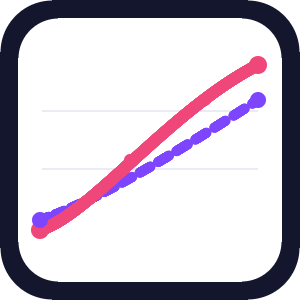

# Comparative Line Chart — Power BI custom visual

A dual cumulative line chart with an **interactive comparison-range selector**. Compare two measures over time, drag handles to isolate any sub-period, and read the delta in a fully customisable side panel.



## Highlights

- **Two auto-cumulated series** (A / B) — drop any two numeric measures, the visual sums them per period.
- **Comparison mode** — a pill toggle turns on a draggable range; the panel shows the two cumulated totals plus the delta (absolute + %).
- **Rich per-series data labels** — independent colour, font, bold/italic, background, position preset (auto / above / below / left / right) and manual X/Y offset per series, with automatic collision avoidance and optional leader lines.
- **Smart Y axis** — tick count adapts to the viewport; top grid line always lands on a graduation; thousand separator inherited from the measure's format string (locale-aware).
- **Auto-grow left padding** so Y-axis labels never clip.
- **Side panel** — fully themeable (colours, sizes, separators, delta colours, radius, padding, width %).
- **Period selectors** — two native-looking dropdowns with full styling (border, bg, text, hover, selected, radius, padding).
- **Animations** — polyOut / cubicOut / expoOut / backOut / elasticOut + optional shimmer sweep + staggered marker pop.
- **Landing page** — friendly welcome when no data is bound.
- **EN + FR** localisation (178 strings).
- Persists comparison state (on/off, from, to) across report reloads via `persistProperties`.

## Field wells

| Role     | Description                                    |
| -------- | ---------------------------------------------- |
| Period   | A date, a month or any ordered axis            |
| Series A | First measure — the visual cumulates per period |
| Series B | Second measure — the visual cumulates per period |

## Build

```bash
npm install
npm run lint
npm run package              # .pbiviz in dist/
npx pbiviz package --certification-audit
```

Tested against **Power BI Visuals API 5.11.0**, TypeScript 5.5.4, D3 v7.

## Status

- ✅ Build green, lint green, cert audit green (no external requests, certificate valid).
- ✅ `supportsLandingPage`, `supportsHighlight`, `supportsKeyboardFocus`, `supportsMultiVisualSelection` enabled.
- ✅ Custom icon, EN + FR resources.

## Author

**Sammy KARAR** — [karar.sammy@outlook.fr](mailto:karar.sammy@outlook.fr)

## License

[MIT](LICENSE) © 2026 Sammy KARAR.
